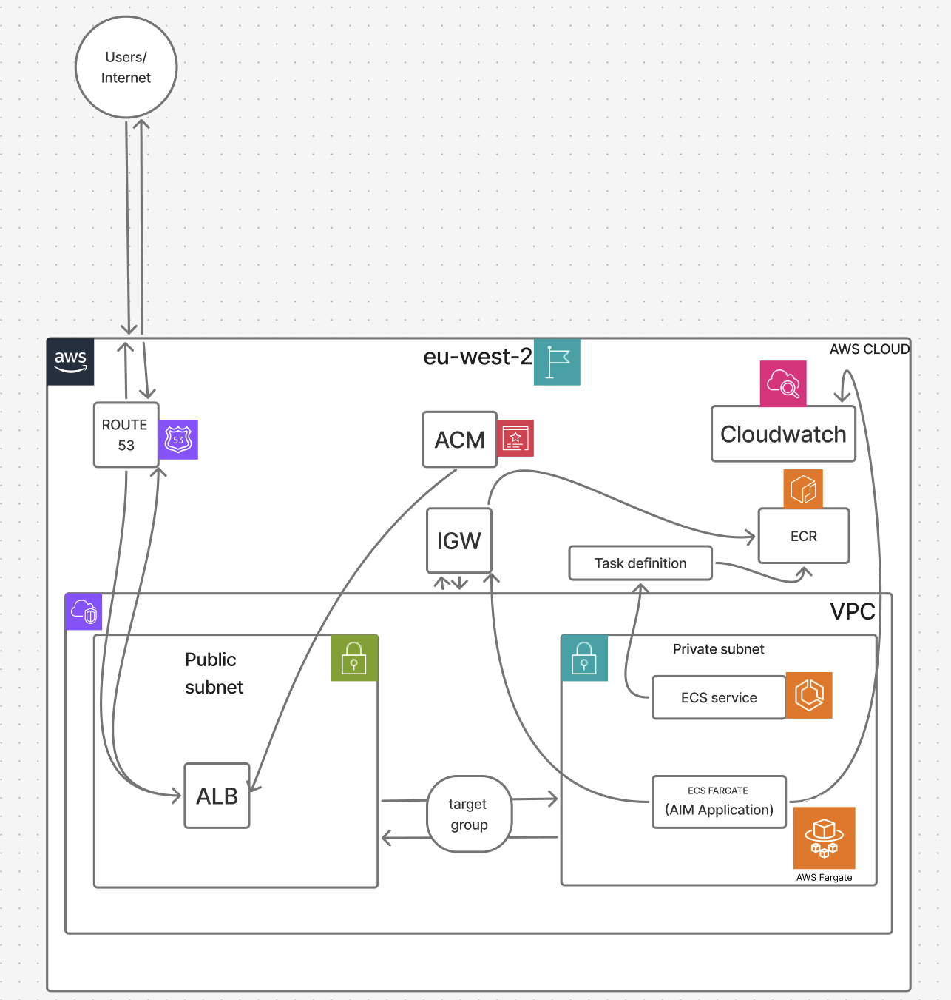
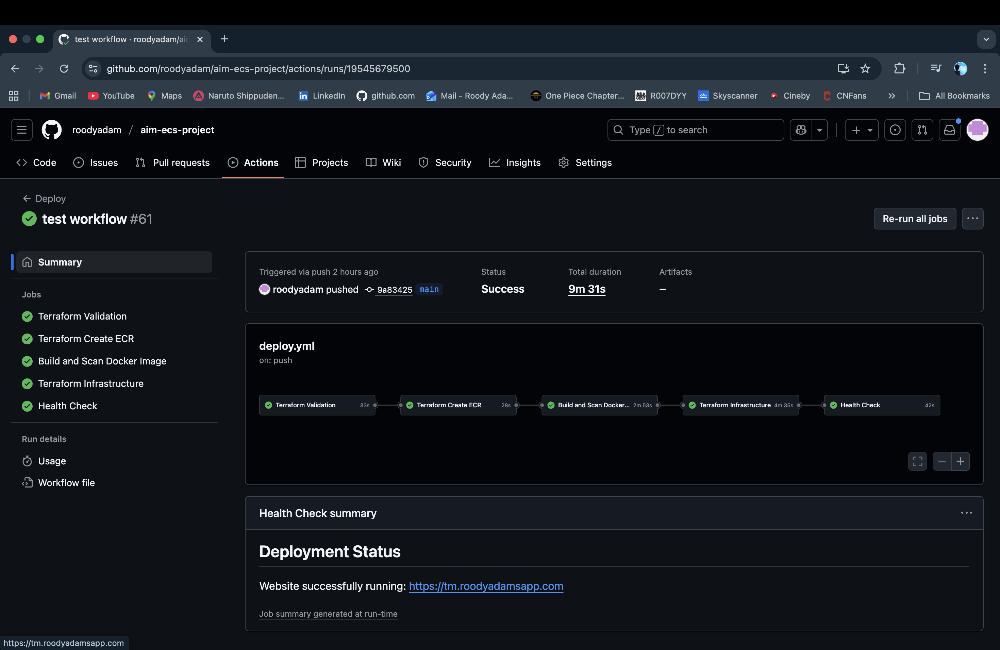

# Aim ECS Deployment Project

A production-ready infrastructure-as-code project for deploying [Aim](https://github.com/aimhubio/aim) (an open-source ML experiment tracking tool) on AWS ECS using Terraform and GitHub Actions CI/CD.

## Architecture Diagram



*Architecture diagram showing the complete AWS infrastructure setup for the Aim application deployment on ECS Fargate.*

## Deployment Status



*The CI/CD pipeline successfully passing all stages including Terraform validation, Docker image build, security scanning with Trivy and TfSec, and infrastructure deployment to AWS.*


*The Aim web application running in production with HTTPS encryption on the custom domain https://tm.roodyadamsapp.com, deployed on AWS ECS Fargate.*

## Description of the Project

This project sets up the infrastructure needed to run Aim on AWS Elastic Container Service (ECS). It includes modular Terraform configurations for all AWS resources, automated deployment through GitHub Actions, and a Docker-based container setup.

The infrastructure is production-ready with load balancing, SSL/TLS certificates, high availability across multiple availability zones, and security best practices built in. The architecture uses ECS Fargate for serverless container hosting, which scales automatically based on demand.

Key features include automated deployments that trigger on pushes to the main branch, HTTPS encryption with ACM certificates, private subnets for application security, CloudWatch logging and monitoring, GitHub Actions CI/CD with OIDC authentication, and reusable Terraform modules for VPC, ECS, ALB, ECR, Route53, and IAM. The pipeline also includes security scanning with Trivy and TfSec.

## Demo of the Application

The application is live at https://tm.roodyadamsapp.com and running in production on AWS ECS.

Aim is an open-source experiment tracking tool for machine learning. It lets you track experiments, log metrics and parameters, visualize results through a web-based UI, and integrate with popular ML frameworks like PyTorch, TensorFlow, and Keras.

You can use it to track ML experiments and runs, visualize metrics and compare different runs, search and filter experiments, store artifacts and model checkpoints, and monitor experiments in real-time.

## Local Setup

You'll need an AWS account with appropriate permissions, Terraform 1.6.0 or higher, AWS CLI configured with your credentials, Docker for local development, Python 3.11 or higher for local Aim development, and Git.

Start by cloning the repository:

```bash
git clone https://github.com/roodyadam/aim-ecs-project.git
cd aim-ecs-project
```

Create a `terraform.tfvars` file in the `infra/` directory with your configuration:

```hcl
aws_region = "eu-west-2"
project_name = "aimapp"
domain_name = "your-domain.com"
subdomain = "tm"
container_port = 80
container_cpu = 256
container_memory = 512
desired_count = 1
github_repo = "your-username/aim-ecs-project"
certificate_arn = "arn:aws:acm:region:account:certificate/cert-id"
hosted_zone_id = "Z1234567890ABC"
```

Note that `terraform.tfvars` is in `.gitignore` for security, so never commit sensitive values.

Before running Terraform, make sure you have an S3 bucket for Terraform state and a DynamoDB table for state locking. Update the backend configuration in `infra/main.tf` with your bucket and table names.

To deploy the infrastructure:

```bash
cd infra
terraform init
terraform plan
terraform apply
```

For local development of the Aim application:

```bash
cd aim
pip install -r requirements.txt
aim up --host 0.0.0.0 --port 8080
```

The Aim UI will be available at http://localhost:8080.

To build and test the Docker image locally:

```bash
cd aim
docker build -t aim-app:local -f docker/Dockerfile .
docker run -p 8080:80 aim-app:local
```

For CI/CD setup, configure the `AWS_GITHUB_ACTIONS_ROLE_ARN` secret in your GitHub repository under Settings → Secrets and variables → Actions. The workflow environment variables are already configured in the deploy and destroy workflow files.

Deployments happen automatically when you push to the main branch, or you can trigger them manually from the Actions tab. To destroy infrastructure, go to Actions → Destroy Infrastructure → Run workflow and type "destroy" to confirm.

## Project Structure

```
aim-ecs-project/
├── .github/
│   └── workflows/
│       ├── deploy.yml
│       └── destroy.yml
├── aim/
│   ├── aim/
│   ├── docker/
│   │   └── Dockerfile
│   └── main.py
├── infra/
│   ├── main.tf
│   ├── variables.tf
│   ├── outputs.tf
│   ├── terraform.tfvars
│   └── modules/
│       ├── vpc/
│       ├── ecs/
│       ├── alb/
│       ├── ecr/
│       ├── iam/
│       ├── route53/
│       └── acm/
└── README.md
```

## Configuration

The GitHub Actions workflows use these environment variables:

- `AWS_REGION`: AWS region (eu-west-2)
- `DOMAIN_NAME`: Your domain name
- `GITHUB_REPO`: GitHub repository in format 'owner/repo'
- `CERTIFICATE_ARN`: ACM certificate ARN for HTTPS
- `HOSTED_ZONE_ID`: Route53 hosted zone ID

You can customize these Terraform variables:

- `container_cpu`: CPU units for ECS tasks (default: 256)
- `container_memory`: Memory in MB for ECS tasks (default: 512)
- `desired_count`: Number of ECS tasks to run (default: 1)
- `subdomain`: Subdomain for the application (default: "tm")

## Development

Run tests with:

```bash
cd aim
pytest tests/
```

For linting:

```bash
cd infra
terraform fmt -check
tflint

cd aim
ruff check .
```

The CI/CD pipeline automatically runs TfSec for Terraform security scanning and Trivy for Docker image vulnerability scanning.

## Additional Resources

- [Aim Documentation](https://aimstack.readthedocs.io/)
- [Terraform AWS Provider](https://registry.terraform.io/providers/hashicorp/aws/latest/docs)
- [AWS ECS Documentation](https://docs.aws.amazon.com/ecs/)

## Security

The infrastructure follows security best practices:

- Terraform state is stored in an encrypted S3 bucket
- State locking is handled via DynamoDB
- ECS tasks run in private subnets
- Security groups use least privilege access
- All traffic is encrypted with HTTPS/TLS
- GitHub Actions uses OIDC authentication instead of long-lived credentials

## License

This project uses the Aim open-source license. See `aim/LICENSE` for details.

## Contributing

1. Fork the repository
2. Create a feature branch
3. Make your changes
4. Submit a pull request

## Contact

For issues and questions, please open an issue on GitHub.

---

Note: This is an infrastructure project. The Aim application code is included as a subdirectory. For Aim-specific contributions, refer to the [Aim repository](https://github.com/aimhubio/aim).
