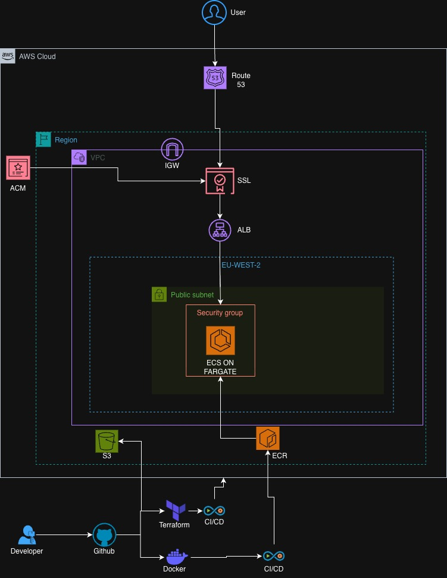
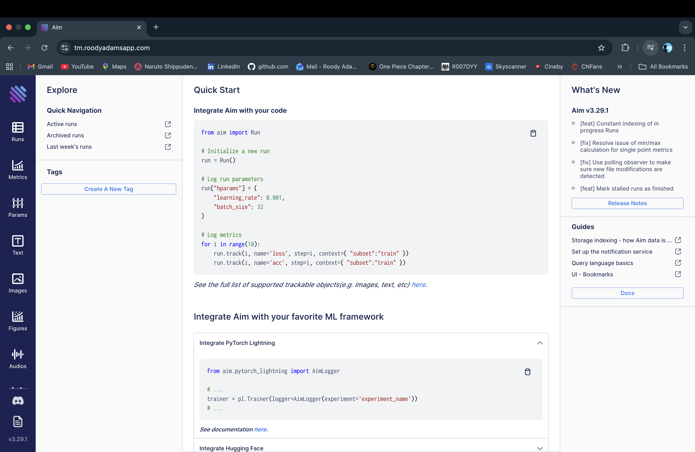

# Aim ECS Deployment Project

A production-ready infrastructure-as-code project for deploying [Aim](https://github.com/aimhubio/aim) on AWS ECS using Terraform and GitHub Actions CI/CD.

## What is Aim?

**Aim** is an open-source machine learning experiment tracking tool that helps data scientists and ML engineers:
- **Track experiments**: Log metrics, parameters, hyperparameters, and metadata from ML training runs
- **Visualize results**: Interactive web UI to compare experiments, visualize metrics over time, and analyze model performance
- **Organize work**: Search, filter, and group experiments to find the best models
- **Collaborate**: Share experiment results with team members through a centralized interface

Aim provides an alternative to tools like MLflow, Weights & Biases, and TensorBoard, with a focus on simplicity and powerful visualization capabilities.

## What This Project Does

This project deploys Aim as a **production-ready, cloud-hosted web application** on AWS infrastructure. Instead of running Aim locally or on a single server, this setup provides:

- **Scalable hosting**: Runs on AWS ECS Fargate, which automatically handles container orchestration and can scale based on demand
- **High availability**: Deployed across multiple availability zones for fault tolerance
- **Secure access**: HTTPS encryption with custom domain support (e.g., `https://tm.roodyadamsapp.com`)
- **Automated deployments**: CI/CD pipeline that builds, tests, and deploys on every code push
- **Production infrastructure**: Load balancing, private networking, monitoring, and security best practices built-in

The application is accessible via a web browser, allowing ML teams to track and visualize experiments from anywhere, with all data persisted in cloud storage.

## Architecture Diagram



*Architecture diagram showing the complete AWS infrastructure setup for the Aim application deployment on ECS Fargate.*

## Deployment Status


*The CI/CD pipeline successfully passing all stages including Terraform validation, Docker image build, security scanning with Trivy and TfSec, and infrastructure deployment to AWS.*



*The Aim web application running in production with HTTPS encryption on the custom domain https://tm.roodyadamsapp.com, deployed on AWS ECS Fargate.*

## Description of the Project

This project sets up the infrastructure needed to run Aim on AWS Elastic Container Service (ECS). It includes modular Terraform configurations for all AWS resources, automated deployment through GitHub Actions, and a Docker-based container setup.

The infrastructure is production-ready with load balancing, SSL/TLS certificates, high availability across multiple availability zones, and security best practices built in. The architecture uses ECS Fargate for serverless container hosting, which scales automatically based on demand.

Key features include automated deployments that trigger on pushes to the main branch, HTTPS encryption with ACM certificates, private subnets for application security, CloudWatch logging and monitoring, GitHub Actions CI/CD with OIDC authentication, and reusable Terraform modules for VPC, ECS, ALB, ECR, Route53, and IAM. The pipeline also includes security scanning with Trivy and TfSec.

## Demo of the Application

[Watch Demo Screen Recording](https://www.loom.com/share/11dce8d46d0949a9ba34c37633aa17df)

This demo shows the Aim web application interface and demonstrates how it tracks machine learning experiments, logs metrics and parameters, and visualizes results through its web-based UI.

## Local Setup

Prerequisites: Python 3.11+.

Run locally:

```bash
pip install aim  
aim up --host 0.0.0.0 --port 8080
```

The Aim UI will be available at http://localhost:8080.

## Project Structure

```
aim-ecs-project/
├── .github/
│   └── workflows/
│       ├── deploy.yml
│       └── destroy.yml
├── aim/
│   ├── aim/
│   ├── docker/
│   │   └── Dockerfile
│   └── main.py
├── infra/
│   ├── main.tf
│   ├── variables.tf
│   ├── outputs.tf
│   ├── terraform.tfvars
│   └── modules/
│       ├── vpc/
│       ├── ecs/
│       ├── alb/
│       ├── ecr/
│       ├── iam/
│       ├── route53/
│       └── acm/
└── README.md
```

## Development

Run tests with:

```bash
cd aim
pytest tests/
```

For linting:

```bash
cd infra
terraform fmt -check
tflint

cd aim
ruff check .
```

The CI/CD pipeline automatically runs TfSec for Terraform security scanning and Trivy for Docker image vulnerability scanning.


## Security

The infrastructure follows security best practices:

- Terraform state is stored in an encrypted S3 bucket
- State locking is handled via DynamoDB
- ECS tasks run in private subnets
- Security groups use least privilege access
- All traffic is encrypted with HTTPS/TLS
- GitHub Actions uses OIDC authentication instead of long-lived credentials
